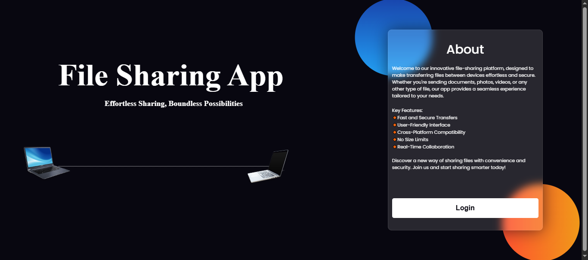
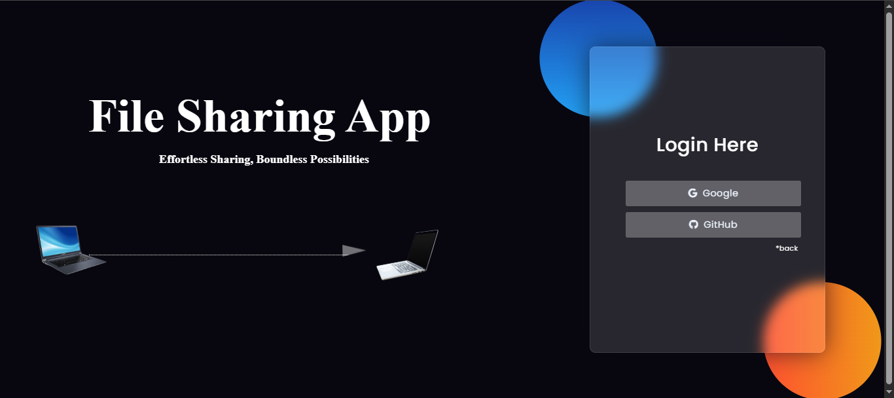
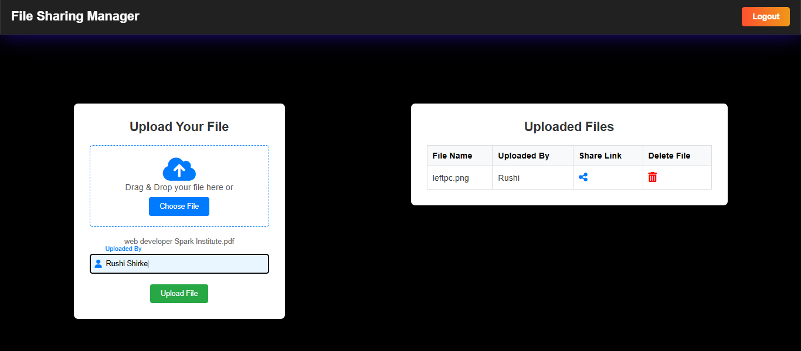
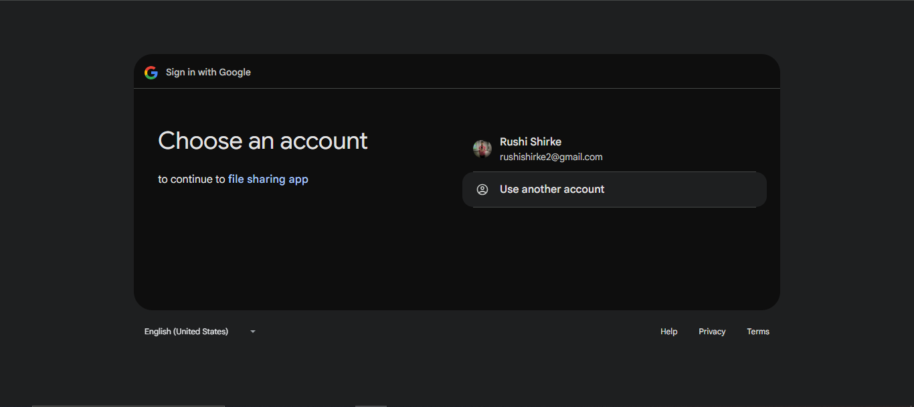
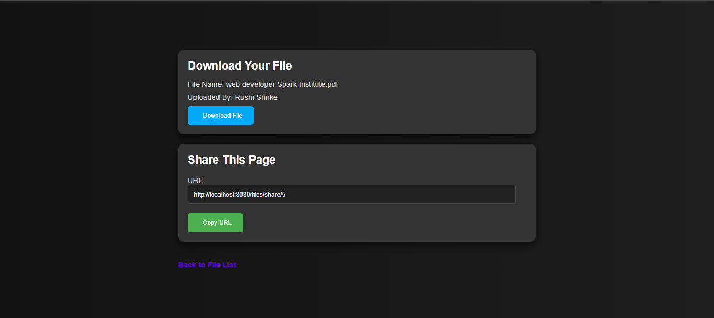

# 📁 File Sharing App

A simple and secure file sharing application built using **Spring Boot** and **Thymeleaf**.  
Users can log in via **GitHub** or **Google OAuth**, upload files, generate public shareable links, and allow downloads without requiring login for recipients.

## 📄 Description

This application allows users to:
- Log in using their GitHub or Google account (OAuth2).
- Upload files and specify the uploader's name.
- Share a public link with others for direct file download.
- Delete uploaded files if necessary.

No regular email/password login is supported for simplicity and better security via OAuth.### ✨ Key Features:
- Login via **GitHub** or **Google OAuth**
- Upload files with uploader’s name
- Files are stored **locally** on the server
- File metadata (filename, path, uploader, etc.) is stored in the **database**
- Generate **public shareable links** for downloading
- Anyone with the link can download the file (no login required)
- Delete uploaded files anytime

> 🛑 Regular username/password login is **not implemented**.## 📸 Screenshots

### 🔹 Home Page  

### 🔹 Login Page  

### 🔹 Dashboard Page  

### 🔹 Authentication 

### 🔹 File Shared via Link (No Login Required)  

---## 🚀 How to Run the Project

### 🧰 Prerequisites
- Java 17+
- Maven
- Google/GitHub OAuth credentials setup

Clone the repository and run in eclipse -> spring boot-> run 
   ## 🛠️ Technologies Used

- 🌱 Spring Boot
- 🌐 Thymeleaf
- 🔐 Spring Security (OAuth2 login)
- ☁️ Google & GitHub OAuth
- 💾 File Storage System